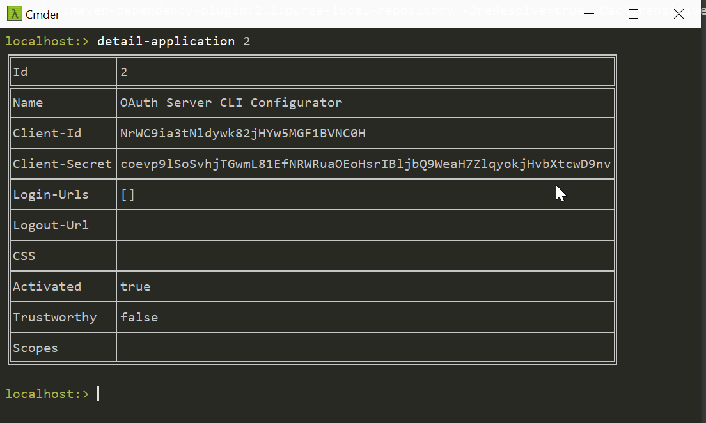

# Welcome to the Simple-OAuth-Client-Config project

The goal of this project is to provide an easy configuration interface to set up, 
configure and monitor any OAuth2 server based on the [Simple-OAuth-Server Project](https://github.com/tmseidel/simple-oauth-server).

# Getting started
1. Download the latest release artifact.
2. Start the application with `java -jar simple-oauth-config-client-<VERSION>.jar`

# Using the console
If you have started the application you see the console. If you press _TAB_ you will see a list of available commands.
For further information please visit the [Simple-OAuth-Server Project](https://github.com/tmseidel/simple-oauth-server) and its
 documentation for the features and what to do with this program.

